# MBTI

> ## 선의의 옹호자 INFJ

  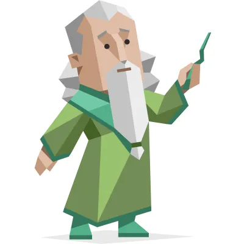

| 
`MBTI적 장점`
 | 
`실제 장점`
 | 
`MBTI적 단점`
 | 
`실제 단점`
 |
| :-------------: | :-----------: | :-------------: | :-----------: |
| 공감능력      | 성실함      | 소심함        | 내성적      |
| 창의성        | 친절함      | 고구마        | 고구마      |
| 독립심        | 소통        | 강박          | 우유부단    |
| 원칙주의      | 긍정적      | 번아웃        | 걱정        |

 

> ### MBTI로 성격을 조금은 이해할 수 있지 않을까?
> **요즘 많은 사람들의 아이스브레이킹 토크로 많이 쓰이는 MBTI를 소개해봤습니다.** 
> **MBTI를 맹신하진 않지만 그래도 어떠한 사람을 이해하는 도구로 유용하다 생각합니다!**  

 

 

# 취미

> ## 세상을 더욱 아름다운 눈으로 이해해보자

  
  
  

  
  
  

> ### 사진이라는 취미를 시작하며 든 생각이었습니다. 
> *내가 느끼는 세상은 남들과 과연 똑같은가?* 
> *그렇지 않다면 내가 나만의 세상을 사진에 담아보자!*  
>  
> **다양한 취미를 가지고 있지만 그 중에서도 유독 좋아하는 것들입니다. **
>  
> **처음엔 사진은 크게 관심이 없었지만 여행을 다니다보니** 
>  
> **눈으로만 보고 기억으로만 남기기엔 아쉽게 느껴져 점점 사진에 관심을 쏟기 시작했습니다. **

 

 

# 음악과 문학

> ## 박제가 되어버린 천재를 아시오.

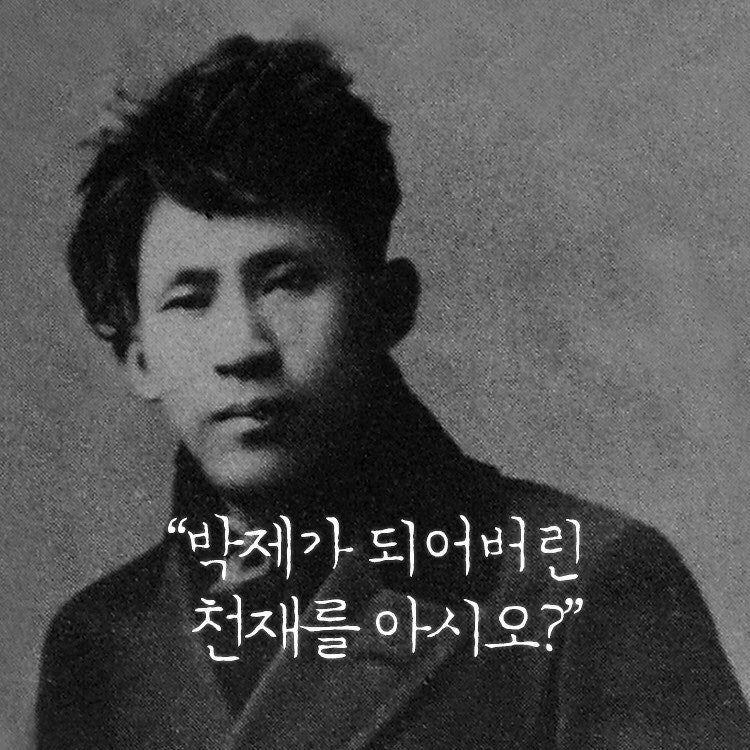

> **최근 봤던 소설인 이상의 날개의 가장 유명한 대사를 인용해봤습니다.**  
>  
> **여러 소설들을 시간 나면 보는 경향이지만 취미라기엔 시간을 많이 쏟진 않는 것 같습니다.**  
> **이상의 날개 외에도 최근에 프란츠 카프카의 변신, 히가시노 게이고의 백조와 박쥐 등을 읽었습니다.**  
>  
> **글을 읽는 것도 좋아하지만 글을 쓰는 것도 역시 좋아합니다.** 
> **사실 진짜 취미는 글을 쓰는 것인 느낌입니다...**

 

 

> ## 난 너랑 있는 게 제일 좋아

  &nbsp;&nbsp;&nbsp;&nbsp;&nbsp;&nbsp;
  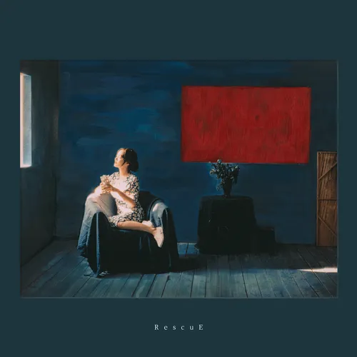
   
   
  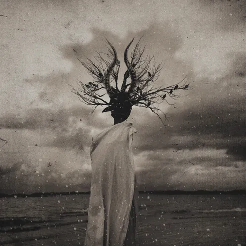&nbsp;&nbsp;&nbsp;&nbsp;&nbsp;&nbsp;
  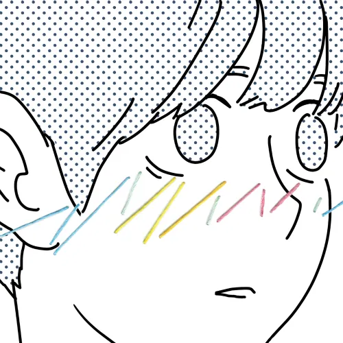

> 

> 
앨범 정보

> 1. 검정치마 - Team Baby 
> 2. 윤하 - RescuE 
> 3. 쏜애플 - 계몽 
> 4. 장범준 - 장범준 2집 
> 

 
 
 

> ### '혜야' 
> **제목은 검정치마 Team Baby 앨범에 있는 '혜야' 라는 곡의 한 구절입니다.**  
> **제가 가장 애정하는 노래이자 가장 추천하고 싶은 곡입니다.** 
>  
> **누군가를 생각한다면 떠오르는 그런 감정들이 잘 녹아 들었다 생각합니다.** 
> 
> 
><u>물론 이 외에도 여기 있는 앨범들은 우열을 가릴 수 없이 사랑하는 것들입니다!</u>

 

 

# 경험

> ## '아직은' 초보입니다!

  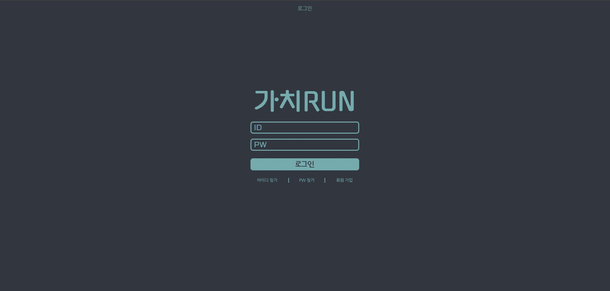
  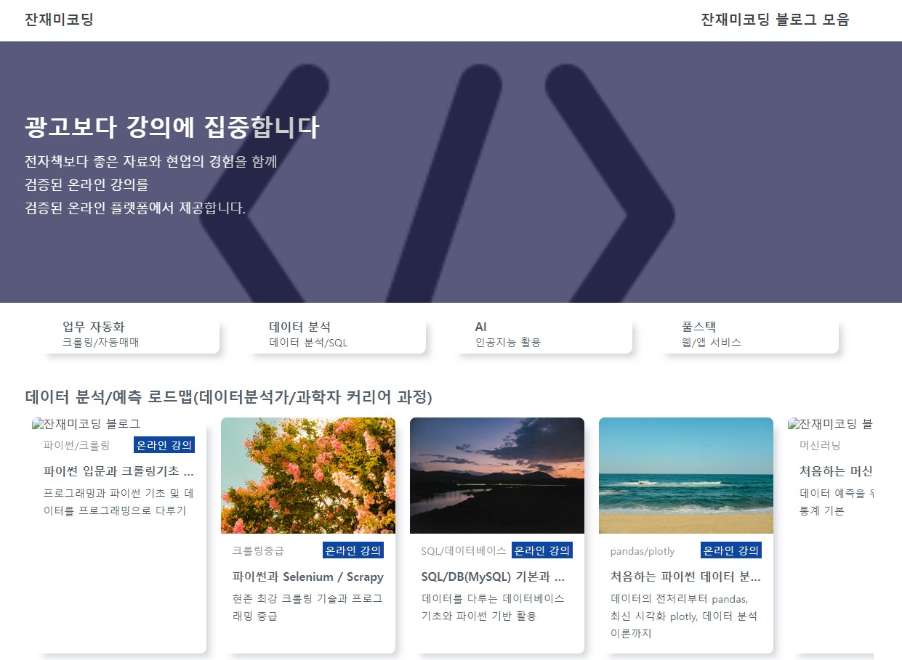
  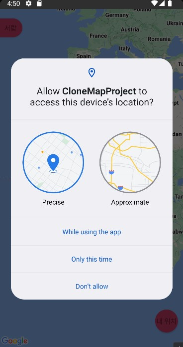
  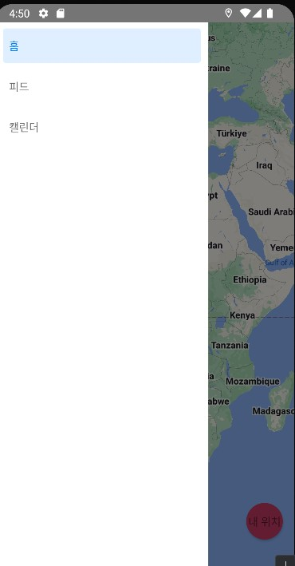

> 

> 
이게 뭔가요?

> 조금 부끄럽지만 혼자서 따라하기도 해보고 혼자서도 해본 결과물들입니다.  
> 
> 1. 혼자서 디자인과 HTML과 CSS를 익힐겸 했던 작업입니다.  
> 2. HTML과 CSS를 강의로 배울때 따라했던 클론코딩입니다.  
> 3. 최근 RN에 관심이 생겨 지도 어플을 구현하는걸 따라했던 클론코딩입니다.
></deatils>

 
 
 

> ### 할 수 있는건 노력뿐!
> 시작은 남들처럼 초보로 시작했습니다. 
> <u>하지만 결과는 초보로 멈춰있고 싶지 않습니다.</u> 
>  
> 아직은 많이 부족하지만 계속해서 발전해보겠습니다.

 

 

> ## 걱정되는 것은..? 역시 팀플!

  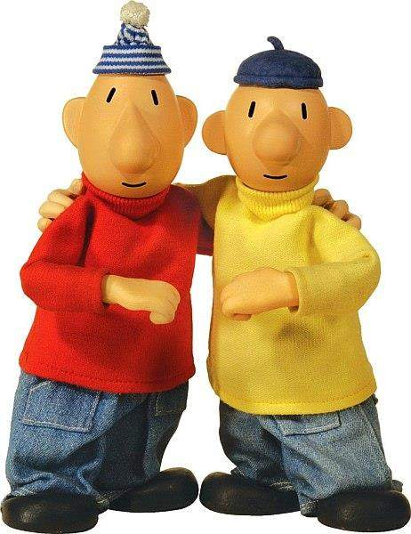

> 다들 좋은 분일거라 생각돼서 큰 걱정은 없습니다! 
> 하지만 그럼에도 원하는 인물상이 있냐고 물어보시면!
> 

> 
없습니다! 다 좋습니다!

> 1. 대화를 할 때 상대방의 의견에도 귀를 기울여줬음 좋겠습니다. 
> 2. 아무래도 '팀'인 만큼 문제 발생이나 긴급상황 발생 시 눈치보지 않으셨음 좋겠습니다. 
> 3. 부족할 수 있습니다! 저도 많이 부족하니까요.. 하지만 같이 노력하는 팀원이면 좋겠습니다. 
> 

 

 

> ## 마지막으로 하고 싶으신 말씀 있으실까요?

  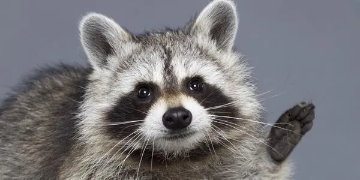

> 앞으로 6개월동안 잘 부탁드립니다! 
> 힘들어지는 순간이 있을거라 생각하는데 그땐 도움을 요청해보겠습니다ㅜㅜ 
>  
> 그리고 최근에 수업을 들으며 강사님께서 해주신 말씀이 있으셨습니다. 
> 제가 최근 SSAFY에서도 면접까지 갔다가 탈락을 한 경험이 있었는데, 
> 그때 당시엔 무엇이 문제인지 몰랐습니다. 
> 
> 하지만 정답이 아닐지라도 사람을 설득하려는 자세, 본인의 주장을 똑바로 할 수 있는 자세에 대하여 말씀해주셨던 기억이 있습니다. 
> 
> 그 순간 면접에서의 패인 중 가장 큰 이유가 무엇인지가 생각났습니다. 
> 이렇게 하루하루 저의 문제점을 잡아가며 수업에 임할 수 있도록 하겠습니다. 
> 
> 그리고 이건 개인적인 성격의 단점을 고쳐보고자 생각한 것인데 
> 공부 뿐 아니라 교육이 끝났을때 편하게 연락할 수 있는 분을 한 분이라도 만들어보겠습니다! 
>
> 이제 날이 추워지는데 환절기 감기 조심하시고 항상 행복하세요! 