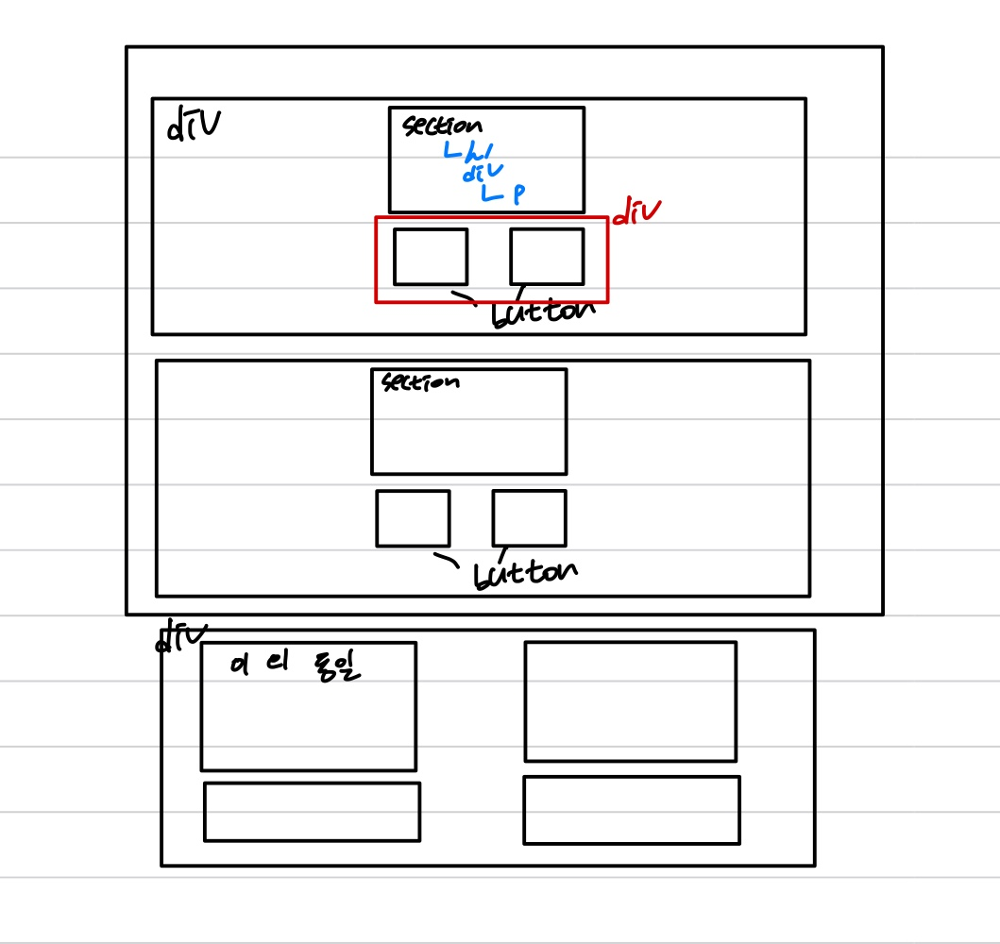
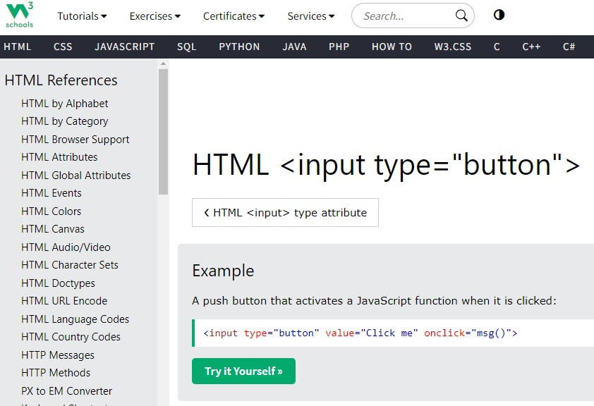

# apple 제품 카드
[HTML링크](https://littlestar0508.github.io/homework/apple/apple.html)<br/>


## 일반형과 와이드형 전환 그리드


## 일반형과 2x2 전환 그리드


## 목차
<ul>
<li>

[마크업 순서](#마크업-순서)
<li>

[1024px break-point](#1024px-break-point)
<li>

[그리드](#그리드)
<li>

[배경 이미지](#배경-이미지)
<li>

[제품 설명 텍스트](#제품-설명-텍스트)
<li>

[아쉬운 점과 추후 고려 사항](#아쉬운-점과-추후-고려-사항)
</ul>

## 마크업 순서



### div의 역할들
 우선 그리드의 영역을 두 가지로 나눴습니다 <br>
1. 와이드와 일반 형태의 이미지가 전환되는 그리드(div) <br>
2. 일반 형태와 2x2 형태로 전환되는 그리드(div) <br>

따라서 각각을 ```div태그로 컨테이너로써``` 감싸줬습니다. <br>

또한 ```버튼 2개의 컨테이너```와 <br>
제품에 대한 설명글을 나타내주는 ```p태그들을 묶기위한 컨테이너```로써<br>
```div 태그를 채택```했습니다.

그리고 ```링크를 나타내는 버튼```들을 button태그로 마크업하지 않고<br>
```input태그로 마크업```을 하여 ```label```과 한쌍(```component```)을 이루도록 알아보기 위해<br>
버튼 컴포넌트 하나를 div 태그로 마크업했습니다.

### section태그 선택의 이유
```section태그``` 내부에 존재하는 항목들은 다음과 같다고 생각했습니다.<br>
<ul>
<li> 제품명
<li> 제품에 대한 설명
<li> 추후 출시 예정 문구
<li> 더 알아보기 버튼
<li> 가격 보기 버튼
</ul>

이때 ```제품명은 제목```으로써 동작할 수 있다 생각하여 section 태그를 선택했습니다.

### button 태그를 안쓰고 왜 input 태그를 썼나?
처음 UI를 봤을때 반드시 button 태그만을 사용해서 마크업해야 한다 생각했습니다.<br>
하지만 계속 고민하다보니 ```button태그 안에 a태그```를 넣어 마크업을 하는게 번거로워질 수 있다 생각했습니다.<br>
그렇다면 ```input에서 type="button"```을 부여하고 클릭 시 동작하는 방법은 없을까 고민하다<br>
다음과 같은 속성을 발견했습니다.



그렇다면 이게 더 쉽게 해결되지 않을까! 하는 생각에 input으로 마크업 하게 되었습니다.

## 1024px break-point

```media query```로 ```모바일 퍼스트```로 작성했습니다.

1. wide grid container
2. 2x2 grid container
3. 공통된 영역

이렇게 세 부분을 모두 나눠 설계했습니다.<br>
이유는 1번과 2번의 이미지 변화가 서로 달라 ```분리된 container```를 사용했기 때문입니다.<br>
또한 ```코드의 중첩```을 피하고자 ```공통된 영역을 분리```해 다른 곳에 배치했습니다.<br>

> ###  왜 ```container query```는 고려 안했나요? <br>
> ```container query```를 배웠지만 제가 제대로 이해하지 못해 혼자서 복습을 했습니다. <br>
> (```container query```를 왜 사용해야되는지도 이해를 못했던 상황이었습니다.) <br>
> 아직은 100% 이해를 했다고 장담은 못하지만 이해한 바에 따르면 <br>
> ```container query```는 특정 ```component```가 차지하는 영역의 크기에 따라 <br>
> ```media query```는 ```전체 viewport 영역```의 크기에 따라 작동하도록 설계한다. <br>
> 라고 이해했습니다. 따라서 이는 ```viewport 영역의 크기에 의존```된다 생각하여 <br>
> ```media query로 설계```했습니다. <br>

## 그리드

```그리드```는 ```screen-width가 1024px 이상```일때는

1. wide grid container는 1x3
2. 2x2 grid container는 2x2

```이하```일때는

1. wide grid container는 똑같이 1x3
2. 2x2 grid container는 1x4

로 변환되도록 설계했습니다.

## 배경 이미지

쉬울거라 생각하던 배경이미지에서 애를 많이 먹었습니다.<br>
그 이유는 배경을 배치하면 그 순간 이미지가 너무 커서 제품이 아예 안보이거나<br>
혹은 반응형으로 작동할때 이미지의 높이가 일정하지 않는 이슈가 있었습니다.<br>

<br>

하지만 수업 시간에 배웠던 기억을 살려 ```background-size```에 많은 속성을 부여해봤습니다.<br>
우선 가장 best로 해결된 방법은 ```background-size:cover;``` 를 부여하는 것이었습니다.<br>

### 험난했던 과정들
<ul>
  <li>
  
  ```background-size:100% 100%;```
  
  </li>
  <li>

```background-size:fit;```

  </li>
  <li>
  
  ```background-size:contain;```
  
  </li>
</ul>
<br>

그렇다고 해서 모든 게 해결되진 않았습니다.<br>
사실 ```background-size:cover;```도 나중에 해결한 것이고<br>
그 전에 ```이미지가 나타나는 위치를 조정```하여 제품이 보이게 설정했습니다.<br>
이는 ```background-position:50% 50%;``` 를 부여하고 나서 완료가 됐습니다.<br>

### 이젠 진짜 끝?!?!<br>
이라고 생각하고 나니 반응형에서 동작할때 이미지의 ```높이가 고정이 되지 않는 이슈```가 발생했습니다.<br>
사실 해당 내용은 그리드에 옮겨도 무방하다고 생각합니다.<br>
하지만 ```background-image에서 고민했던 내용```이라 이 영역에 작성했습니다.<br>
<br>

우선 제일 처음으로 생각했던 것은<br>
```background-image```에서 ```image의 크기를 고정```시키면 높이도 고정이 되지 않을까? 하는 생각이었습니다.<br>
하지만 ```background-image```에서 image의 크기를 고정시키는 방법이 떠오르지 않아<br>
```grid-template-rows의 값을 조절```해 ```셀의 높이를 제한```했습니다.

## 제품 설명 텍스트

이번 과제를 하면서 놓칠뻔한 부분이었습니다.<br>
```1024px 이상```이 되면 설명 ```텍스트가 일렬로 배치```되는 녀석들이 존재했습니다.<br>
처음에는 ```p태그로 마크업```을 했기에 화면의 변화가 생겨도 여전히 ```column으로 배치```됐습니다.<br>
하지만 ```1024px 이상```이 되면 ```p태그```를 감싸는 ```container의 display 값을 inline```으로 바꿔 해결했습니다.<br>

## 아쉬운 점과 추후 고려 사항
1. ```subgrid```의 사용
> 사실 이번 과제를 처음 보고 ```subgrid```가 괜찮겠는데? 라고 생각했습니다.<br>
> 하지만 과제를 진행하다 보니<br>
> ```subgrid```는 ```부모 grid의 grid-template-columns와 grid-template-rows 값```을 가져오는게 아니었나?<br>
> 라고 생각하게 되면서 ```subgrid```를 사용하지 못했습니다.<br>
> 이는 아직 ```subgrid```에 대한 무지라 생각해 앞으로 새로운 이해가 필요할 것으로 생각됩니다.<br>

2. 코드의 간결화
> 이번 과제를 진행하며 여실히 느꼈습니다. <br> 
> 아직은 코드 작성에 있어 미숙하구나!<br>
> 이런 생각을 하게 된 이유는 다름아닌 효율적인 코드 작성이었습니다. <br>
> 과제를 마무리 하며 코드 간결화를 진행했지만 아직은 부족하다 생각합니다. <br>

3. css 적용 우선 순위
> 이번에 가장 아쉽다고 생각한 부분이었습니다.<br>
> 수업 시간에 ```media query```를 들었을때도 제 과제와 똑같은 문제가 발생했던 걸로 기억합니다.<br>
> 바로 밖에 작성한 ```media query```가 작동하지 않는 문제였습니다.<br>
> 이는 ```css 적용 우선 순위```에서 밀려서 그렇다는 설명을 들었지만<br>
> 해결하는 방법이 제대로 기억이 나지 않아 ```!important```로 해결했습니다.<br>
> 하지만 위험한 방법이라고 생각하기에 많이 아쉬웠습니다.<br>