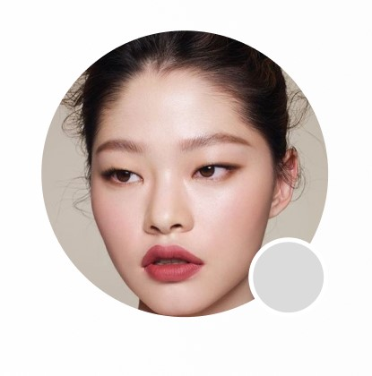
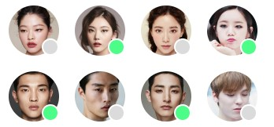
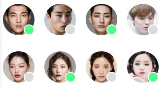

# 노종국 2주차 과제

### 프로필 사진 활동중, 비활동중

<center>



</center>

> 위와 같은 이미지를 만들기 위해 ```float```와 ```flex```를 사용하는 것을 많이 고민했습니다.<br>
> 하지만 이는 제가 생각했던 것보다 동작이 수월하지 않았고, 다른 방법을 고민했습니다.<br>
> 그렇게 찾게 된 방법이 ```position```을 이용하는 방법이었습니다. <br>
> 부모 요소에 ```position```을 ```relative```로 주고 활동중과 비활동중을 나타내는<br>
> 원에 ```position```을 ```absolute```로 주어 이미지와 ```div```태그를 겹치게 유도했습니다.

<br>

### 이미지 방향 정렬

<center>



</center>

> 이미지를 정렬하기 위해 ```float```을 사용했습니다.<br>
> ```float```은 단순히 오른쪽으로 혹은 왼쪽으로 요소들을 정렬하는데 이는 일렬로 정렬됩니다.<br>
> 따라서 ```body태그```의 ```width```와 ```height```를 제한하여 줄바꿈이 되도록 유도했습니다.<br>
> _*width와 height는 figma에서 참고했습니다*_<br>
> 그리고 ```float:left``` 라는 속성을 주어 정렬했습니다.

<br>

### 이미지 방향 역정렬
<center>



</center>

>이미지를 역정렬하기 위해 ```flex```의 속성들을 사용해보았습니다.  <br>
>우선 자식 요소들에게 ```flex``` 속성을 주기 위해 <br>
>```body태그```에 ```display:flex```를 부여했습니다. <br>
>그러면 이미지가 억지로 일렬로 정렬하려고 줄어들게 됩니다. <br>
>이를 방지하기 위해 ```flex-wrap```의 속성을 주었습니다. <br>
>다음으로 정상적으로 정렬한 후 행만 서로 바꾸어주면 되기 때문에 <br>
>```flex-wrap:wrap-reverse```로 설정했습니다. 

<br>

### 추가적인 코멘트

>```flex-wrap```을 사용하게 되면 ```margin```이 좀 더 커지는 것 처럼 보이는데 <br>
>이를 ```margin```을 각각 조율하여 정할까 생각해봤지만 코드의 가독성이 너무 저하되어 실행해보지 않았습니다.<br>
>이를 해결할 방법이 무엇인지 궁금합니다.


