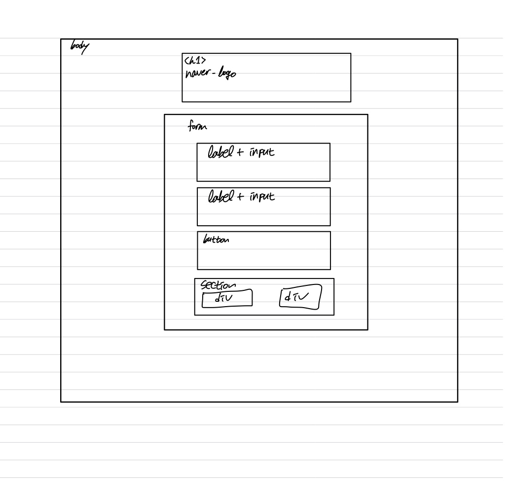

# 3주차 과제 
[HTML링크](https://littlestar0508.github.io/homework/login/login.html)

## 목차
<ul>
<li>[마크업 순서](#마크업-순서)
<li>[반응형](#반응형)
<li>[모바일 퍼스트](#모바일-퍼스트)
<li>[유효성 검사](#유효성-검사)
<li>[ON-OFF기능](#on-off기능)
<li>[그 이외에 다양한 CSS들](#그-이외의-다양한-css들)
<li>[아쉬운 점](#아쉬운-점)
<li>[후기](#후기)
</ul>

> ### 마크업 순서
 첫번째로 마크업을 해야겠다 라고 생각하고 손그림으로 그려봤습니다.
 

수업때 언급하셨던 로고를 h1 태그로 지정하고 그 외 나머지는 form태그로 생각하고 마크업을 했습니다.

#### 마크업 보충 설명
맨 아랫줄은 section으로 묶게 되었는데 이 부분은 로그인 옵션이라는<br>
하나의 틀로 설명 가능하다 생각해서 마크업을 하게 되었습니다.
<br> <br>
하지만 그 안에 두 개의 div태그가 존재합니다.<br>
이는 로그인 상태 유지를 묶어주는 container와 IP보안 상태를 묶어주는 container라 생각해서<br>
div태그로 마크업을 하게 되었습니다.
<br><br>
부가적인 요소가 있다면 h1 태그 내부에 a태그를 사용하여 메인 페이지로 이동할 수 있는 점<br>
그리고 section + h2(제목 태그) / input + label 태그를 신경썼습니다.


> ### 반응형
  그렇게 html을 시멘틱한 구조로 구성한 후 제일 처음으로 생각났던 것이 반응형 작업이었습니다.<br>
  사실 flex를 사용해서 하게 될 줄 알았지만 media query를 사용하라고 언급하셨던 부분이 있었습니다.<br>
  우선적으로 신경썼던 부분은 모바일 환경에서 화면이 줄어들면 그에 맞게 form태그가 줄어드는 것이었습니다.<br>
  
```css
  .login_insert_info {
    inline-size: 100%;
    padding-inline: 1.25rem;
    margin-block-start: 3.125rem;
  }
```

이와 같은 방식을 사용해 부모 요소의 width를 따르도록 설계했습니다.<br>
그러다가 가지게 된 의문점이 있었습니다.

> 모바일 로그인 폼 로그인 폼의 가로 크기는 100%(좌/우 여백 각 20px 포함)로 설정할 것

이 문장을 보고 살짝 주춤했습니다.<br>
하지만 뒤에 나올 input태그에 padding-inline 속성을 부여해서 해결했습니다.

> ### 모바일 퍼스트

>모바일 퍼스트란?

모바일 퍼스트라는 단어를 처음 들어봐서 자연스럽게 검색을 하게 됐습니다.<br>
그렇게 검색을 하니 모바일 퍼스트와 데스크탑 퍼스트에 대해 알게됐습니다.<br>
모바일 퍼스트란 설계 과정에서 모바일을 우선적으로 디자인 하고 이후 데스크탑을 설계하는 것이라 이해했습니다.<br>
<br>

모바일 퍼스트를 사용하기 위해서는 media query의 조건을 min-width로 지정하여 설계하는 것이 적합하다고 판단했습니다.<br>

따라서 다음과 같은 설계가 되었습니다.

```css
  @media (min-width: 768px) {
    inline-size: 500px;
    margin-inline: auto;
  }
```

데스크탑의 경우엔 폼의 너비가 500px로 고정되어 나타나기에 inline-size를 100% 에서 500px로 변경했습니다.<br>
중앙 정렬을 위해 margin-inline값도 auto로 지정했습니다.<br>
(이 요소는 form태그 안에 있습니다.)

<p align="center">


</p>

>### 유효성 검사
사실 이는 javascript로 많이 한다고 생각했습니다. <br>
하지만 CSS로도 가능하다고 말씀하셔서 최대한 노력한 파트입니다.<br>
초기 아이디어와 기본적인 설계는 이렇습니다.

>validation이 유효하다면 p태그가 display:none; 으로 변환된다면 어떨까?

이때 sr-only와 display:none을 고민했지만 결국 display:none; 으로 설계한 이유는<br>
sr-only는 screen reader가 인식하지만 display:none은 인식하지 않는다는 점이었습니다.<br>
실제로 유효성이 성립한다면 이는 읽어들일 필요가 없는 구문이기 때문입니다.

```css
  .invalid_pwd,
  .invalid_id {
    display: none;
    color: var(--wrong-validate);
    margin-block-start: 0.125rem;
    margin-block-end: 0.3125rem;
    font-size: 0.75rem;
  }

  .input_pwd:invalid + .invalid_pwd,
  .input_id:invalid + .invalid_id {
    display: block;
  }
```

invalid일때는 기본적으로 보이지 않지만 유효성이 일치하지 않는다면<br>
display:none; 에서 display:block; 으로 바꿔 보이도록 유도했습니다.<br>

<center>


</center>


> ### ON-OFF기능
제가 정말 고민한 요소였습니다.<br>
어떻게하면 javascript로 구현하지 않아도 매끄럽게 넘어갈까<br>

#### 로그인 유지
고민한 과정은 다음과 같습니다.<br>
>1. 이미지 태그를 넣어 클릭 이벤트 발생 시 같은 자리에 다른 이미지로 치환
>2. input clicked를 사용
>3. input type="check"를 사용해 이미지 변환

결과적으로 3번을 채택했고 나머지를 채택하지 못한 이유는 다음과 같았습니다.<br>

>1. 당연하게 :click 조건이 CSS에 있을거라 생각했지만 실제로는 :hover와 :activate만 존재
>2. 결과적으로 javascript를 사용해야 가능

input 태그에 type을 search로 두고 background-image를 svg파일로 대체했더니 가능했었습니다.<br>

```css
  .stay_chk + label {
    display: block;
    inline-size: 1.5rem;
    block-size: 1.5rem;
    background-image: url("../assets/checked.svg");
    background-repeat: no-repeat;
  }

  .stay_chk:checked + label {
    display: block;
    inline-size: 1.5rem;
    block-size: 1.5rem;
    background-image: url("../assets/unchecked.svg");
    background-repeat: no-repeat;
  }
```
<br>

#### IP보안 ON-OFF

하지만 이는 로그인 유지 버튼을 위한 것일 뿐 아직 IP보안 ON OFF의 기능은 없었습니다.<br>
역시 마찬가지로 똑같이 svg파일로 추출하여 같은 방식으로 해도 됐지만 도전정신이 생겼습니다.<br>
이미지와 마찬가지로 텍스트도 역시 작동시킬 수 있지 않을까?? 하는 생각이 들었습니다.<br>
조금 고생을 하긴 했지만 그래도 구현은 성공했습니다.<br>

```css
  .ip_secu_chk + label::after {
    content: "ON";
    color: var(--btn-bgc);
    font-weight: 800;
  }

  .ip_secu_chk:checked + label::after {
    content: "OFF";
    color: #999999;
    font-weight: 800;
  }
```

<center>


</center>

> ### 그 이외의 다양한 CSS들
<ul>
<li> placeholder의 padding

>placeholder와 텍스트가 input태그 바로 왼쪽에 있어서 살짝 여백을 주기 위해 padding을 설정했습니다.<br>
>이 과정에서 input태그가 로그인 버튼보다 길어지는 것을 방지하기 위해<br>
>box-sizing:border-box를 추가했습니다.

<br>

<li>sr-only

>이번 주에 수업을 들으며 input태그와 label태그가 같이 쓰여야한다는 것을 상기하며 label태그를 사용했습니다.<br>
>하지만 디자인적으로 label태그는 보여지지 않으므로 sr-only를 사용했습니다.<br>
>이때 label은 screen-reader에게 읽혀야 하므로 display:none; 은 선택하지 않았습니다.

<br>

<li>custom-propertis

>사실 저는 custom-properties에 대해 전혀 모르고 있었습니다.<br>
>하지만 유지보수 측면에서 좋다는 생각이 들어 한 번 사용하는 연습을 해봤습니다.<br>
>아직은 미숙하다고 느끼고 또 제대로 사용했는지에 대한 의문도 들지만<br>
>사용법에 대해 익힌다는 생각으로 임했습니다.<br>

<br>

<li>시멘틱 마크업

>저번 주 과제에선 아무 생각없이 태그를 사용하고 또한 어떤 상황인지 제대로 인지하지 못했습니다.<br>
>하지만 이번 주는 나름대로 신경을 써가며 요소 하나하나가 어떠한 이유로 마크업이 되어야하는지<br>
>생각했습니다.<br>

<br>

<li>키보드 접근성

>시멘틱 마크업을 하며 키보드 접근성에 대해 검색하게 되었습니다.<br>
>저는 tab키를 사용하여 접근하도록 유도하였고<br>
>접근해야 하는 로그인 상태유지 버튼과 IP보안 ON-OFF버튼을<br>
>input 태그로 감싸 접근이 가능하도록 유도했습니다.<br>

<br>

<li>논리 속성

>기존에 사용하던 width와 height 혹은 left,right 매우 직관적이고 흠이 없다고 생각하여 계속 사용하였습니다.<br>
>하지만 ltr과 rtl의 존재를 알고 나서 모든 사람들에게 접근성을 높이기 위해선<br>
>논리 속성의 사용을 습관화하여야 한다고 생각했습니다.<br>
>따라서 기존의 버릇이던 것을 버리고 inline-size 혹은 margin-block 과 같은 논리 속성을 사용해봤습니다.

<br>
<li>로그인 유지와 IP보안 순서

>모바일 환경에선 IP보안 container가 나타나지 않는 대신 그 자리에 로그인 유지가 와야했습니다.<br>
>이를 해결하기 위해 로그인 유지 container와 IP보안 container를 row-reverse 배치를 했습니다.<br>
>그렇게 되면 IP보안 container 이 display:none;이 됐을때 그 자리에 로그인 유지 container가 올 수 있었습니다.

</ul>

> ### 아쉬운 점
<ul>
<li>IP보안 ON-OFF

> IP보안 ON-OFF에서 항상 같은 UI를 유지하면 좋겠지만 ON에서 OFF로 바뀔때<br>
> 글자의 크기가 달라져 디자인적으로 거슬리는 부분이 생겼습니다.<br>
> 이를 해결하기 위해 width값도 주고 display값 변경 후 주축 정렬,수직축 정렬을 사용했습니다.<br>
> 하지만 문제가 해결되지 않아 조금 아쉬운 점이 되었습니다.

<br>

<li>유효성 검사

>유효성 검사는 submit을 하거나 input을 떠났을때 나타나면 좋다고 생각합니다.<br>
>하지만 제가 만든 코드를 따라가면 input태그가 값이 있든 없든 유효성 검사가 나타나는 점과<br>
>페이지가 시작하자마자 유효성 검사가 나타나 불편하다는 점이 있습니다.<br>
>이는 해결할 수 있을 것 같은데 하면서도 아이디어가 떠오르지 않아 아쉬웠습니다.

<br>

</ul>

### 후기
>많은 시간을 들여 해보려고 노력했습니다!<br>
>아직은 시멘틱 마크업이 부족하다고 느끼고 있습니다.<br>
>물론 css도 역시 부족하다고 느끼지만 그래도 역시 기본 틀을 만드는 것이 더욱 힘들다 느끼고 있습니다.<br>
>과제가 어려운 부분도 쉽다고 느끼는 부분도 있었지만 최대한 모든 것을 담아보려 노력했습니다.<br>
>앞으로는 기본적인 것에 집중하며 더욱 노력해보겠습니다.